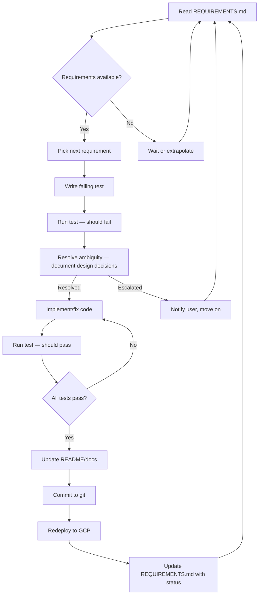

# Autonomous TDD Process

> **How the autonomous development loop works for the Sudoku project.**
> This document defines the end-to-end process for iterative, autonomous
> development driven by requirements in [REQUIREMENTS.md](REQUIREMENTS.md).

---

## Overview

The agent runs an autonomous TDD (Test-Driven Development) loop that processes
requirements from `REQUIREMENTS.md`, implements them with tests, deploys to GCP,
and commits to git — all without requiring interactive back-and-forth with the user.

Communication happens through the requirements file:
- **User** adds bullet-point requirements
- **Agent** adds comments under each requirement with progress
- **Agent** updates deployment status so the user knows what's in production

---

## Process Flow



### 1. Read Requirements

- Read `REQUIREMENTS.md` at the start of each iteration
- Process items in the order they appear, but may group or reorder if related items are better tackled together
- Skip items already marked ✅ Done or ❌ Failed

### 2. Write Tests First (TDD)

- **Write a failing test** before implementing any feature or fix
- Tests should be at the appropriate level:
  - **Unit tests** (`tests/test_*.py`) for logic/algorithms
  - **Integration tests** for API endpoints
  - **E2E tests** (`tests/test_e2e_sudoku.py`) for UI/UX features
- Run the test to confirm it **fails** (proves the test is valid)

### 3. Resolve Ambiguity

When a requirement has ambiguity or requires design choices:

1. **Resolve it** — make the most reasonable choice based on context and existing patterns
2. **Document it** — add an explicit **Design Decisions** section under the requirement in `REQUIREMENTS.md`:
   ```markdown
   - Add timer pause feature
     - 🚧 In progress
     - **Design Decisions:**
       - Pause button placed next to timer (not in a menu) — matches existing UI pattern
       - Timer stops counting but display stays visible (greys out) — user can see paused state
       - Space key also pauses (in addition to button) — matches keyboard shortcut pattern
       - Used `performance.now()` instead of `setInterval` for accuracy — solves drift issue
   ```
3. **Escalate** — if the ambiguity is too high or the choice is too fundamental to make
   without user input:
   - Document the question and options in `REQUIREMENTS.md` under the requirement
   - Notify the user in chat
   - Move on to the next requirement (don't block the loop)

### 4. Implement / Fix

- Make the minimum change needed to pass the test
- Follow existing code patterns and conventions
- Preserve existing comments and docstrings

### 5. Verify No Regressions

- Run the full test suite: `PYTHONUNBUFFERED=1 venv/bin/python3 run_all_tests.py --all`
- All previously-passing tests must still pass
- If a regression is found, fix it before proceeding

### 6. Update Documentation

- Update `README.md` if the change affects:
  - Feature list
  - API endpoints
  - Test counts
  - Setup/deployment instructions
- Update `DEV_LOG.md` or `E2E_TDD_LOG.md` with a phase summary
- Update `REQUIREMENTS.md` with a comment under the requirement

### 7. Commit to Git

- `git add -A && git commit -m "descriptive message"`
- Commit after each meaningful task (not every file change)
- **Do NOT push** — pushing is behind a password
- Notify the user: "Committed: [hash] — [message]"
- **Add the commit link** to the requirement's status in `REQUIREMENTS.md`:
  ```markdown
  - ✅ Done: [summary]. Commit: [`abc1234`](file:///path/to/repo)
  ```

### 8. Deploy to GCP

- Redeploy regularly so the user can test manually
- Deploy command: `PROJECT_ID=ppardyak-cad ./scripts/deploy.sh`
- Update the **Deployment Status** table in `REQUIREMENTS.md`:
  - Last deployed timestamp
  - Revision
  - Git HEAD
  - Test count
- If deploy fails, iterate on the fix

### 9. Update Requirements File

- Mark the requirement as ✅ Done, ❌ Failed, or 🚧 In progress
- Add a comment summarizing what was done
- For ❌ Failed: explain why the requirement cannot be met and what was attempted
- Note any remaining gaps or issues
- Move completed items to the "Completed" section

### 10. Loop

- Return to step 1 and pick the next requirement
- If no requirements remain:
  - Wait for new requirements from the user
  - OR extrapolate new requirements from existing work/patterns
  - Document any self-identified requirements in "Agent-Extrapolated Requirements"

---

## Roles & Responsibilities

### User

| Responsibility | How |
|----------------|-----|
| Add requirements | Bullet points in `REQUIREMENTS.md` under "Active Requirements" |
| Manual testing | Test the deployed app at `http://localhost:8080` (via proxy) |
| Request redeploy | Drop a message in chat: "redeploy" |
| Push to remote | Run `git push` manually (behind password) |
| Switch to interactive | Start chatting normally — agent will resume the loop when told |

### Agent

| Responsibility | How |
|----------------|-----|
| Process requirements | In order, from `REQUIREMENTS.md` |
| TDD | Write failing test → implement → verify → pass |
| No regressions | Run full test suite after every change |
| Git commits | After each meaningful task, notify user |
| Deploy to GCP | Regularly, update status in `REQUIREMENTS.md` |
| Documentation | Keep README, logs, and requirements file current |
| Extrapolate | Identify and document self-derived requirements when idle |

---

## Testing Levels

| Level | What | Where | Count |
|-------|------|-------|-------|
| Unit | Sudoku logic, solver, validation | `tests/test_sudoku*.py`, `tests/test_validation*.py` | ~137 |
| Storage | Game persistence, CRUD | `tests/test_storage*.py` | ~70 |
| Integration | API endpoints, multi-component | `tests/test_app*.py`, `tests/test_*_api.py` | ~671 |
| Deployed | HTTP smoke tests against Cloud Run | `tests/test_deployed_service.py` | ~10 |
| E2E UI | Playwright browser tests | `tests/test_e2e_sudoku.py` | ~80 |

**Total: ~968 tests** (run with `venv/bin/python3 run_all_tests.py --all`)

---

## Deployment Lifecycle

### Clean → Deploy cycle (for full resets)

```bash
# Clean up all GCP resources
PROJECT_ID=ppardyak-cad ./scripts/cleanup.sh

# Deploy fresh (with audits)
PROJECT_ID=ppardyak-cad ./scripts/deploy.sh

# Start proxy for manual testing
gcloud run services proxy sudoku --region=us-central1 --project=ppardyak-cad --port=8080
```

### Quick redeploy (update code only)

```bash
PROJECT_ID=ppardyak-cad SKIP_AUDITS=true TF_ARGS="" ./scripts/deploy.sh
```

### Known gotchas

1. **Firestore deletion** — Firestore databases survive terraform destroy.
   Cleanup script Phase 0 deletes it before terraform disables the API.
2. **Firestore propagation delay** — After deleting Firestore, wait ~30s
   before redeploying or you'll get a 409 "Database already exists" error.
3. **gcloud auth expiry** — Tokens expire periodically. Run
   `gcloud auth login` and `gcloud auth application-default login` when needed.
4. **Artifact Registry** — If a deploy fails mid-way, the AR repo may persist
   and block the next deploy's audit. Delete manually or run cleanup.

---

## Git Workflow

| Operation | Command | Auto-approved |
|-----------|---------|---------------|
| Status | `git status` | ✅ |
| Add | `git add -A` | ✅ |
| Commit | `git commit -m "msg"` | ✅ |
| Push | `git push` | ❌ (user only) |
| File edits | `write_to_file`, `replace_file_content` | ✅ |
| File moves/deletes | `mv`, `rm` via terminal | ✅ |

---

## Resuming the Loop

The loop can be paused and resumed at any time:

- **Pause**: User starts an interactive conversation
- **Resume**: User says "resume the loop" or "continue TDD"
- The agent re-reads `REQUIREMENTS.md` and picks up where it left off
- State is tracked in the requirements file (✅ / 🚧 / ⏳)

---

## Communication Protocol

All async communication goes through `REQUIREMENTS.md`:

```markdown
- Add dark mode toggle persistence across sessions
  - ✅ Done: Theme saved to localStorage, restored on page load. 
    Added E2E test test_theme_persistence. Committed as abc123.

- Add real-time multiplayer mode
  - ❌ Failed: Requires WebSocket support not available in current Flask 
    deployment. Would need migration to Flask-SocketIO or a separate service.
    Attempted long-polling approach but latency was unacceptable.
```

The agent also notifies in chat after each commit and deploy.
