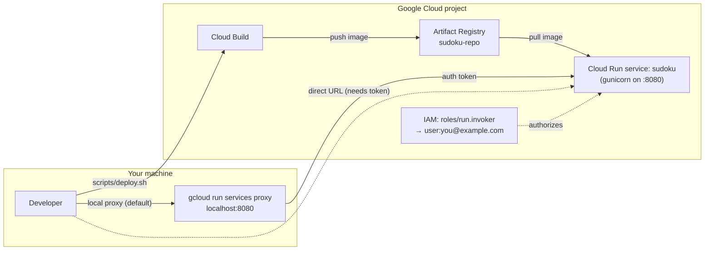

# 🎯 Sudoku

A modern, interactive Sudoku web application built with **Python** and **Flask**.
Generate fresh puzzles, play in your browser, and track your time and mistakes.

 

---

## ✨ Features

### Core Gameplay
- **Procedural Puzzle Generation** — every game produces a unique, solvable Sudoku via a backtracking algorithm
- **4 Difficulty Levels** — Easy, Medium, Hard, Expert (30–58 empty cells)
- **Smart Highlighting** — selecting a cell highlights its row, column, 3×3 box, and all matching numbers
- **Real-time Validation** — incorrect entries are flagged instantly in red
- **Mistake Tracker** — keeps count of wrong placements
- **Check Button** — scan the entire board for errors at any time
- **3×3 Box Dividers** — clear visual grid lines separating the nine 3×3 boxes
- **Built-in Timer** — tracks elapsed time; win screen shows your final stats
- **Modern UI** — dark glassmorphism theme, gradient accents, smooth micro-animations

### Game Persistence
- **Auto-Save** — game state is automatically saved every 2 seconds after any change (debounced). Survives browser restarts and backend restarts.
- **Full State Saved** — saves the board, pencil marks, given cells, mistakes, elapsed time, difficulty, undo/redo stacks, and completion status
- **Resume Last Game** — when you reopen the page, your last game is automatically restored so you can pick up where you left off
- **Game List** — click **📂 Load Games** to see all saved games with metadata (difficulty, progress, mistakes, time, last played). Resume any game or delete old ones.
- **Server-Side Storage** — uses **Google Cloud Firestore** in production (survives container restarts), falls back to in-memory storage for local development

### Pencil Marks (Notes)
- Toggle between **Final** (✏️) and **Notes** (📝) mode using the buttons in the right panel, or press `N`
- In **Notes mode**, clicking a number (1–9) toggles a small pencil mark in the selected cell's 3×3 mini-grid
- In **Final mode**, clicking a number places the big number. This hides the cell's pencil marks and auto-removes that same digit from pencil marks in the same row, column, and 3×3 box
- Erasing a final number reveals the preserved pencil marks again

### Smart Numpad
- Number pad buttons **auto-disable** when all 9 instances of a digit have been placed on the board
- Disabled buttons are greyed out and non-interactive
- Buttons re-enable automatically when a digit is removed

### Undo / Redo
- Full **undo/redo** support for every action: placing numbers, toggling notes, erasing, and applying hints
- Up to **200 history snapshots** tracked (board state, notes, given cells, mistakes)
- Buttons in the panel auto-disable when the stack is empty
- Starting a new game clears both stacks

### Hint (Press to Preview)
- **Press the Hint button** — a random empty cell reveals its correct number in **amber/orange** with a glowing border
- **Release the button** — the preview stays; nothing is committed yet
- **Click the amber cell** to apply the hint (committed as a permanent given)
- **Click anywhere else** or **press Escape** to dismiss the preview without applying

---

## 🎮 How to Play

1. Click any empty cell to select it (or use arrow keys to navigate).
2. Toggle between **Final** and **Notes** mode using the buttons in the right panel (or press `N`).
3. Enter a number (1–9) by:
   - Clicking the on-screen number pad, **or**
   - Pressing the corresponding key on your keyboard.
4. To erase a number, press **Backspace/Delete** or click the **⌫** button.
5. The board flags incorrect numbers in red — try again!
6. Use the tools on the right panel when needed:
   - **Check** — highlights all current errors
   - **Hint** — press to preview a correct cell, then click it to apply (or dismiss)
   - **Undo / Redo** — revert or reapply your last actions
7. Fill every cell correctly to win. Your time and mistake count are shown on the win screen.

### Using Pencil Marks (Notes Mode)

- Toggle between **Final** (✏️) and **Notes** (📝) mode using the buttons in the right panel, or press `N` on your keyboard.
- In **Notes mode**, clicking a number (1–9) toggles a small pencil mark in the selected cell's 3×3 mini-grid.
- In **Final mode**, clicking a number places the big number. This hides the cell's pencil marks and auto-removes the same digit from pencil marks in the row, column, and 3×3 box.
- Press **Backspace** or click **⌫** to erase — if the cell has a final number, only the number is removed and preserved pencil marks reappear. Pressing erase again clears all pencil marks.

### Using the Hint

1. **Press** (click and hold) the Hint button — a random empty cell lights up in amber showing its correct number.
2. **Release** the button — the preview stays on screen.
3. **Click the amber cell** to commit the hint (it becomes a permanent given and is added to the undo history).
4. To **dismiss without applying**, click anywhere else on the board or press `Escape`.

### Using Undo / Redo

- Click the **↶ Undo** button to revert your last action (or press `Ctrl+Z`)
- Click the **↷ Redo** button to reapply a reverted action (or press `Ctrl+Y` / `Ctrl+Shift+Z`)
- Works for all actions: placing numbers, toggling notes, erasing, and applying hints
- Up to 200 steps are tracked

### Difficulty Levels

| Level   | Empty Cells | Description                          |
|---------|-------------|--------------------------------------|
| Easy    | 30          | Few blanks, great for beginners       |
| Medium  | 40          | Balanced challenge                   |
| Hard    | 50          | Tough logical deductions required    |
| Expert  | 58          | Minimal clues, for seasoned players |

---

## 📁 Project Structure

```
sudoku/
├── app.py                  # Flask application and API endpoints (game + persistence)
├── sudoku.py               # Puzzle generator & backtracking solver
├── storage.py              # Game persistence layer (Firestore + in-memory fallback)
├── requirements.txt        # Python dependencies (Flask, google-cloud-firestore)
├── run_all_tests.py        # Python test runner (auto-discovers test_*.py)
├── README.md               # This file
├── test_sudoku.py          # Unit tests for puzzle generation & solver
├── test_storage.py         # Unit tests for storage layer (InMemory + Firestore mocked)
├── test_app.py             # Integration tests for Flask API endpoints
├── Dockerfile              # Container image definition (python:3.11-slim + gunicorn)
├── .dockerignore           # Files excluded from Docker build
├── .gcloudignore           # Files excluded from Cloud Build upload
├── static/
│   ├── styles.css          # Dark glassmorphism theme & animations
│   └── app.js              # Game logic: rendering, input, validation, undo/redo, hints, auto-save
├── templates/
│   └── index.html          # Main game UI
├── scripts/
│   ├── deploy.sh           # One-command deploy script (infra → build → deploy)
│   ├── cleanup.sh          # One-command teardown script (8 phases)
│   ├── run_tests.sh        # Bash test runner (with --watch, --quiet, --fail-fast)
│   └── watch_tests.py      # Python file watcher for auto-running tests
└── terraform/
    ├── providers.tf        # Google provider config + enabled APIs
    ├── variables.tf         # All Terraform variables
    ├── cloud_run.tf        # Cloud Run service + IAM + Firestore env vars
    ├── artifact_registry.tf # Docker repository
    ├── firestore.tf        # Firestore database (Native mode)
    ├── iap.tf              # Optional IAP + Load Balancer
    ├── outputs.tf          # Terraform outputs
    └── terraform.tfvars.example  # Example variable values
```

### File Responsibilities

| File               | Purpose                                                              |
|--------------------|----------------------------------------------------------------------|
| `app.py`           | Flask server exposing `/`, `/api/new-game`, and `/api/games` CRUD endpoints |
| `sudoku.py`        | Core logic: `generate_puzzle()`, `generate_solved_board()`, `_solve()` |
| `storage.py`       | Game persistence: `InMemoryStorage` (dev), `FirestoreStorage` (prod), `get_storage()` factory |
| `templates/index.html` | HTML structure: board, numpad, mode toggle, undo/redo, hint, games list, win modal |
| `static/styles.css`    | Visual design: layout, colors, animations, disabled states, hint preview, games modal |
| `static/app.js`        | Client logic: cell selection, number/notes, undo/redo, numpad, hints, auto-save, game list |
| `test_sudoku.py`       | 31 unit tests: solver, validity checking, puzzle generation, uniqueness verification |
| `test_storage.py`      | 20 unit tests: InMemoryStorage CRUD, FirestoreStorage (mocked), factory |
| `test_app.py`          | 12 integration tests: Flask API endpoints for game persistence CRUD |
| `Dockerfile`           | Container image: python:3.11-slim, gunicorn, port 8080 |
| `scripts/deploy.sh`    | One-command deploy: infra bootstrap → Cloud Build → Cloud Run deploy |
| `scripts/cleanup.sh`   | One-command teardown: 8 phases including Firestore cleanup |
| `scripts/run_tests.sh` | Bash test runner with --watch, --quiet, --fail-fast flags |
| `run_all_tests.py`     | Python test runner: auto-discovers test_*.py files |
| `terraform/firestore.tf` | Firestore database (Native mode) + API enablement |
| `terraform/cloud_run.tf` | Cloud Run service, IAM, Firestore env vars |

---

## 🚀 Getting Started

### Prerequisites

- **Python 3.8+** (tested with 3.11)
- **pip** (Python package manager)

### Standard Installation & Running

```bash
# 1. Navigate to the project folder
cd /usr/local/google/home/ppardyak/Dogfood/sudoku

# 2. (Optional) Create and activate a virtual environment
python3 -m venv venv
source venv/bin/activate     # on Windows: venv\Scripts\activate

# 3. Install dependencies
pip install -r requirements.txt

# 4. Start the Flask server
python3 app.py
```

The app will be available at **[http://localhost:5000](http://localhost:5000)**.

### Alternative: Virtualenv Without `ensurepip` (Corporate Environments)

If `python3 -m venv` fails because `ensurepip` is not available (common in restricted corporate environments), you can bootstrap pip manually:

```bash
# 1. Navigate to the project folder
cd /usr/local/google/home/ppardyak/Dogfood/sudoku

# 2. Create a venv without pip
python3 -m venv --without-pip venv

# 3. Bootstrap pip via get-pip.py
curl -sS https://bootstrap.pypa.io/get-pip.py -o /tmp/get-pip.py
venv/bin/python3 /tmp/get-pip.py --quiet

# 4. Install Flask into the venv
venv/bin/python3 -m pip install -r requirements.txt

# 5. Start the Flask server using the venv Python
venv/bin/python3 app.py
```

### Development Mode

The server runs in debug mode by default (`app.run(debug=True)`), so changes to
Python files will auto-reload the server. Static files (JS/CSS) are served as-is —
do a hard refresh in your browser (`Ctrl+Shift+R`) after editing them.

---

## 🧪 Testing

The project has **63 tests** across three test files, all using Python's built-in `unittest` framework (no pytest dependency).

### Test files

| File               | Tests | What it covers |
|--------------------|-------|----------------|
| [test_sudoku.py](test_sudoku.py) | 31 | Solver correctness, board validation, puzzle generation, uniqueness verification |
| [test_storage.py](test_storage.py) | 20 | InMemoryStorage CRUD + ordering + limits, FirestoreStorage (mocked), `get_storage()` factory |
| [test_app.py](test_app.py) | 12 | Flask API integration: create/get/list/update/delete games, 404 handling, undo/redo roundtrip |

### Running tests

**Option 1: Bash runner** (recommended — auto-creates venv, installs deps)

```bash
# Run all tests once
./scripts/run_tests.sh

# Re-run tests automatically when files change
./scripts/run_tests.sh --watch

# Less verbose output
./scripts/run_tests.sh --quiet

# Stop on first failure
./scripts/run_tests.sh --fail-fast
```

**Option 2: Python runner** (auto-discovers all `test_*.py` files)

```bash
# Run all tests
venv/bin/python3 run_all_tests.py

# Run a specific test module
venv/bin/python3 run_all_tests.py --module test_storage

# Stop on first failure
venv/bin/python3 run_all_tests.py --fail-fast

# Watch mode (re-runs on file changes)
venv/bin/python3 run_all_tests.py --watch
```

**Option 3: Direct unittest** (if venv is already set up)

```bash
venv/bin/python3 -m unittest test_sudoku test_storage test_app -v
```

### Auto-running tests on dependency changes

A file watcher script is included that monitors source files and automatically re-runs tests when any change is detected:

```bash
# Using the bash runner's --watch flag (recommended)
./scripts/run_tests.sh --watch

# Or using the standalone watcher
venv/bin/python3 scripts/watch_tests.py
```

The watcher monitors: `sudoku.py`, `app.py`, `storage.py`, `test_*.py`, and `requirements.txt`.

### Test output example

```
🧪 Running all tests (auto-discovered)
────────────────────────────────────────────────────────

test_create_game_returns_id (test_storage.TestInMemoryStorage.test_create_game_returns_id) ... ok
test_full_state_roundtrip (test_storage.TestInMemoryStorage.test_full_state_roundtrip) ... ok
test_create_game (test_app.TestGamePersistenceAPI.test_create_game) ... ok
test_solves_empty_board (test_sudoku.TestSolve.test_solves_empty_board) ... ok
...

────────────────────────────────────────────────────────
✅ All tests passed (45.2s)
   57 passed, 6 skipped, 63 total
```

> [!NOTE]
> The 6 Firestore tests are skipped when `google-cloud-firestore` is not installed locally. They use mocks but require the module to be importable. In the Docker/Cloud Run environment, the library is installed and all tests run.

---

## ☁️ Deploy to Google Cloud (Cloud Run + Terraform)

This app ships with Terraform code that deploys it to **Google Cloud Run** — a fully managed, serverless container platform with built-in HTTPS, automatic scaling (including scale-to-zero), and per-request billing.

### Infrastructure architecture



**Request flow (default — local proxy):** Browser → `localhost:8080` → `gcloud run services proxy` injects your OAuth identity token → Cloud Run verifies against the IAM `roles/run.invoker` binding → Flask app responds.

**Optional IAP flow:** Browser → Global HTTPS Load Balancer → IAP (Google login redirect) → Backend Service → Serverless NEG → Cloud Run. See [Optional: IAP in front of Cloud Run](#optional-iap-in-front-of-cloud-run) below.

### What gets created

| Resource | Terraform file | Purpose |
|----------|----------------|---------|
| Core APIs (5) | [providers.tf](terraform/providers.tf) | Cloud Run, Artifact Registry, Cloud Build, Compute Engine, IAM Credentials |
| Firestore API | [firestore.tf](terraform/firestore.tf) | Firestore (Native mode) for game state persistence |
| *(optional)* IAP APIs (6) | [providers.tf](terraform/providers.tf) | IAP, Certificate Manager, Network Services/Security — only enabled when `enable_iap=true` |
| Artifact Registry repo (`sudoku-repo`) | [artifact_registry.tf](terraform/artifact_registry.tf) | Stores the Docker image |
| Firestore database (`(default)`) | [firestore.tf](terraform/firestore.tf) | Server-side storage for saved games (survives container restarts) |
| Cloud Run service (`sudoku`) | [cloud_run.tf](terraform/cloud_run.tf) | Serves the Flask app via gunicorn on port 8080; injects `FIRESTORE_PROJECT` env var |
| `roles/run.invoker` IAM binding | [cloud_run.tf](terraform/cloud_run.tf) | Grants the authenticated user permission to invoke the service |
| `roles/datastore.user` IAM binding | [cloud_run.tf](terraform/cloud_run.tf) | Grants the Cloud Run service account read/write access to Firestore |
| *(optional)* IAP brand, client, LB, NEG | [iap.tf](terraform/iap.tf) | Identity-Aware Proxy + global HTTPS Load Balancer (see below) |

### Prerequisites

- A **Google Cloud project** with billing enabled
- The following CLIs installed:
  - [`gcloud`](https://cloud.google.com/sdk/docs/install) (Google Cloud CLI)
  - [`terraform`](https://developer.hashicorp.com/terraform/downloads) ≥ 1.5
  - *Docker is **not** required* — the deploy script uses Google Cloud Build for image builds
- Authenticated credentials:
  ```bash
  gcloud auth login
  gcloud auth application-default login   # Terraform uses these creds
  ```

### Install Terraform (Linux / Debian / rodete)

```bash
# 1. Fetch the latest stable version
TF_VERSION=$(curl -sL https://api.releases.hashicorp.com/v1/releases/terraform/latest \
  | python3 -c "import sys,json; print(json.load(sys.stdin)['version'])")

# 2. Download the Linux amd64 binary
curl -sSL -o /tmp/terraform.zip \
  "https://releases.hashicorp.com/terraform/${TF_VERSION}/terraform_${TF_VERSION}_linux_amd64.zip"

# 3. Unzip and install to ~/.local/bin (no sudo required)
unzip -o /tmp/terraform.zip -d /tmp/terraform-bin
mkdir -p "$HOME/.local/bin"
mv /tmp/terraform-bin/terraform "$HOME/.local/bin/terraform"
chmod +x "$HOME/.local/bin/terraform"
rm -rf /tmp/terraform.zip /tmp/terraform-bin

# 4. Ensure ~/.local/bin is on PATH (one-time)
grep -q 'HOME/.local/bin' "$HOME/.bashrc" \
  || echo 'export PATH="$HOME/.local/bin:$PATH"' >> "$HOME/.bashrc"
source "$HOME/.bashrc"

# 5. Verify
terraform version
```

### Deploy — Option A: One-command (recommended)

The included [deploy.sh](scripts/deploy.sh) script orchestrates the full deploy in four phases:

| Phase | What happens |
|-------|--------------|
| 0. Service account | Checks if the default Compute Engine SA exists. If not (e.g. deleted during cleanup), creates a dedicated `{app_name}-sa` SA with Cloud Build + Artifact Registry roles and a logs bucket. |
| 1. Bootstrap | `terraform apply` (targeted, auto-approved) enables APIs (including Firestore API), creates the Artifact Registry repo, and provisions the Firestore database |
| 2. Build | `gcloud builds submit` builds the Docker image in Cloud Build and pushes it to Artifact Registry |
| 3. Deploy | `terraform apply` (full, auto-approved) creates the Cloud Run service + IAM + Firestore env vars, then `gcloud run deploy` rolls out a new revision |

```bash
cd /usr/local/google/home/ppardyak/Dogfood/sudoku
PROJECT_ID=your-gcp-project ./scripts/deploy.sh
```

Optional environment variables:

| Var          | Default       | Description                              |
|--------------|---------------|------------------------------------------|
| `PROJECT_ID` | *(required)*  | GCP project ID                           |
| `REGION`     | `us-central1` | GCP region                               |
| `APP_NAME`   | `sudoku`      | Service + repo name                      |
| `IMAGE_TAG`  | `latest`      | Container image tag                     |
| `TF_ARGS`    | *(empty)*     | Extra args to `terraform apply` (auto-approve is now built-in) |

On success, the script prints the Cloud Run service URL and the image path.

> [!NOTE]
> The deploy script uses **Cloud Build** (not local Docker) to build the image, so you don't need Docker installed or the `docker` group permission.

### Deploying to multiple projects in parallel

The deploy script supports deploying to multiple GCP projects simultaneously. Each project gets its own Terraform state file (`terraform/terraform.tfstate.<project-id>`), so parallel runs don't clobber each other. The script also avoids mutating global `gcloud config` — all `gcloud` commands use explicit `--project` and `--region` flags.

```bash
# Deploy to project A (in one terminal)
PROJECT_ID=project-a TF_ARGS="-auto-approve" ./scripts/deploy.sh &

# Deploy to project B (in another terminal, simultaneously)
PROJECT_ID=project-b TF_ARGS="-auto-approve" ./scripts/deploy.sh &
wait
```

Each deployment is fully isolated:
- **State**: `terraform/terraform.tfstate.<project-id>` — separate state per project
- **Resources**: Artifact Registry repo + Cloud Run service in each project
- **Image**: `us-central1-docker.pkg.dev/<project-id>/sudoku-repo/sudoku:latest` per project
- **Auth**: Uses `gcloud auth application-default` credentials (same user, different projects)

> [!TIP]
> The first deploy to any project must run `terraform init` (the script does this automatically). Subsequent deploys skip init to avoid races.

### Deploy — Option B: Manual step-by-step

```bash
# 1. Set your project
PROJECT_ID=your-gcp-project
REGION=us-central1
IMAGE="${REGION}-docker.pkg.dev/${PROJECT_ID}/sudoku-repo/sudoku:latest"

# 2. Apply Terraform — Phase 1: APIs + Artifact Registry repo
cd terraform
terraform init
terraform apply \
  -var="project_id=${PROJECT_ID}" \
  -target=google_project_service.enabled_apis \
  -target=google_artifact_registry_repository.app_repo

# 3. Ensure a service account exists for Cloud Build + Cloud Run
PROJECT_NUMBER=$(gcloud projects describe "$PROJECT_ID" --format='value(projectNumber)')
DEFAULT_SA="${PROJECT_NUMBER}-compute@developer.gserviceaccount.com"
if gcloud iam service-accounts describe "$DEFAULT_SA" --project="$PROJECT_ID" >/dev/null 2>&1; then
  RUN_SA="$DEFAULT_SA"
  CB_FLAGS=""
else
  # Default SA deleted — create a dedicated one
  SA_EMAIL="sudoku-sa@${PROJECT_ID}.iam.gserviceaccount.com"
  gcloud iam service-accounts create sudoku-sa \
    --display-name="Sudoku Cloud Build + Cloud Run SA" \
    --project="$PROJECT_ID"
  for role in roles/cloudbuild.builds.builder roles/artifactregistry.writer roles/storage.objectAdmin; do
    gcloud projects add-iam-policy-binding "$PROJECT_ID" \
      --member="serviceAccount:$SA_EMAIL" --role="$role" --quiet
  done
  gcloud iam service-accounts add-iam-policy-binding "$SA_EMAIL" \
    --member="user:$(gcloud auth list --filter=status:ACTIVE --format='value(account)')" \
    --role="roles/iam.serviceAccountUser" --project="$PROJECT_ID" --quiet
  # Create logs bucket (required when using a custom SA with Cloud Build)
  gcloud storage buckets create "gs://${PROJECT_NUMBER}-cloudbuild-logs" \
    --project="$PROJECT_ID" --location="$REGION" --quiet
  gcloud storage buckets add-iam-policy-binding "gs://${PROJECT_NUMBER}-cloudbuild-logs" \
    --member="serviceAccount:$SA_EMAIL" --role="roles/storage.objectAdmin" --quiet
  CB_FLAGS="--service-account=projects/${PROJECT_ID}/serviceAccounts/${SA_EMAIL} --gcs-log-dir=gs://${PROJECT_NUMBER}-cloudbuild-logs"
  RUN_SA="$SA_EMAIL"
fi

# 4. Build & push the image via Cloud Build (no local Docker needed)
gcloud builds submit .. --tag="$IMAGE" --project="$PROJECT_ID" $CB_FLAGS --quiet

# 5. Apply Terraform — Phase 2: Cloud Run service + IAM
terraform apply \
  -var="project_id=${PROJECT_ID}" \
  -var="service_account_email=${RUN_SA}"

# 6. Deploy a fresh revision pointing at the pushed image
gcloud run deploy sudoku \
  --image="$IMAGE" \
  --region="$REGION" \
  --project="$PROJECT_ID" \
  --port=8080 \
  --no-allow-unauthenticated \
  --service-account="$RUN_SA" \
  --memory=512Mi --cpu=1 \
  --concurrency=80 --min-instances=0 --max-instances=10

# 7. Get the URL
gcloud run services describe sudoku --region="$REGION" --project="$PROJECT_ID" --format='value(status.url)'
```

### Configuration variables

All variables are in [terraform/variables.tf](terraform/variables.tf). Override with `-var` flags or via a `terraform.tfvars` file (see [terraform.tfvars.example](terraform/terraform.tfvars.example)):

```bash
terraform apply \
  -var="project_id=your-gcp-project" \
  -var="region=europe-west1" \
  -var="min_instance_count=1" \
  -var="memory=1Gi"
```

| Variable                  | Default       | Description                                  |
|---------------------------|---------------|----------------------------------------------|
| `project_id`              | *(required)*  | GCP project ID                               |
| `region`                  | `us-central1` | GCP region for all resources                 |
| `app_name`                | `sudoku`      | Logical name prefix for resources            |
| `image_tag`               | `latest`      | Container image tag to deploy               |
| `service_account_email`   | `null`        | SA for the Cloud Run revision. If `null`, uses the default Compute Engine SA. Set this if the default SA was deleted — `deploy.sh` handles this automatically. |
| `concurrency`             | `80`          | Max concurrent requests per instance         |
| `max_instance_count`      | `10`          | Max container instances                      |
| `min_instance_count`      | `0`           | Min instances (0 = scale to zero)            |
| `memory`                  | `512Mi`       | Memory limit per instance                    |
| `cpu`                     | `1`           | CPU limit per instance                       |
| `allow_unauthenticated`   | `true`        | If true (and `invoker_members` is empty), grants the current gcloud user `roles/run.invoker` instead of `allUsers`. The deploy script uses `--no-allow-unauthenticated` since org policies typically block public access. |
| `invoker_members`         | `[]`          | Explicit IAM members to grant `run.invoker`. Defaults to the current gcloud user. Use `["allUsers"]` for public access (if your org policy allows it). |
| `enable_iap`              | `false`       | If true, creates a global HTTPS Load Balancer with IAP in front of Cloud Run. See [Optional: IAP](#optional-iap-in-front-of-cloud-run). |
| `iap_lb_scheme`           | `EXTERNAL`    | LB scheme for IAP. Use `EXTERNAL` (classic) or `EXTERNAL_MANAGED` (newer). Must be allowed by your org policy. |
| `iap_allowed_users`       | `[]`          | IAM members allowed through IAP. Defaults to the current gcloud user. |
| `domain`                  | `null`        | Optional custom domain for the IAP Load Balancer frontend. |
| `firestore_location`      | `nam5`        | Location for the Firestore database. Use a multi-region (e.g. `nam5`) for best availability or a regional location close to your Cloud Run region. |
| `firestore_enable_pitr`   | `false`       | Enable point-in-time recovery for Firestore (continuous backups). Adds cost but allows restoring to any point in the last hour. |

### Outputs

After `terraform apply`, the following are printed:

| Output                    | Description                                |
|---------------------------|--------------------------------------------|
| `cloud_run_service_url`  | Direct HTTPS URL of the Cloud Run service (requires auth token — not browser-accessible) |
| `cloud_run_service_name` | Name of the Cloud Run service (`sudoku`)   |
| `artifact_registry_image`| Full image path Cloud Run pulls from       |
| `cloud_run_proxy_command`| The `gcloud run services proxy` command to start a local authenticated proxy |
| `load_balancer_ip`       | Global static IP of the IAP LB. `null` when IAP is disabled. |
| `iap_protected_url`      | HTTPS URL protected by IAP. `null` when IAP is disabled. |

### Accessing the app

The Cloud Run service requires authentication on every request. Your org policy likely blocks `allUsers` and `allAuthenticatedUsers`, so the service is **not directly accessible in a browser**. Use one of the methods below.

#### Method 1: Local proxy (default, no extra infra)

`gcloud run services proxy` starts a local server that injects your OAuth identity token into every request:

```bash
gcloud run services proxy sudoku \
  --region=us-central1 \
  --project=your-gcp-project \
  --port=8080
```

Then open [http://localhost:8080](http://localhost:8080) in your browser. Keep the terminal open while you play. Stop with `Ctrl+C`.

> [!TIP]
> If the proxy command is missing, install the component: `sudo apt-get install -y google-cloud-cli-cloud-run-proxy`

#### Method 2: Optional — IAP in front of Cloud Run

For a permanent, browser-friendly URL with a Google login flow, enable Identity-Aware Proxy (IAP). This creates a global HTTPS Load Balancer with IAP in front of Cloud Run.

```bash
terraform apply \
  -var="project_id=your-gcp-project" \
  -var="enable_iap=true" \
  -var="iap_lb_scheme=EXTERNAL"          # or EXTERNAL_MANAGED
```

> [!WARNING]
> IAP requires an external HTTP/HTTPS Application Load Balancer. If your org policy (`compute.restrictLoadBalancerCreationForTypes`) blocks `EXTERNAL_HTTP_HTTPS` and `EXTERNAL_MANAGED_HTTP_HTTPS`, IAP creation will fail. Check with:
> ```bash
> gcloud org-policies describe compute.restrictLoadBalancerCreationForTypes \
>   --project=your-gcp-project --effective
> ```
> If blocked, request an org policy exception or use the local proxy (Method 1).

### Finding deployment status

After deploying, use these commands to check the state of your infrastructure:

#### Cloud Run service status

```bash
# Service URL, region, and condition (Ready/Failed)
gcloud run services describe sudoku \
  --region=us-central1 \
  --project=your-gcp-project \
  --format='value(status.url, status.conditions[0].type, status.conditions[0].state)'

# List all revisions (deploy history)
gcloud run revisions list \
  --service=sudoku \
  --region=us-central1 \
  --project=your-gcp-project

# Current traffic split
gcloud run services describe sudoku \
  --region=us-central1 \
  --project=your-gcp-project \
  --format='value(status.traffic)'
```

#### IAM policy (who can invoke)

```bash
gcloud run services get-iam-policy sudoku \
  --region=us-central1 \
  --project=your-gcp-project \
  --format='table(bindings.role, bindings.members)'
```

#### Container image in Artifact Registry

```bash
gcloud artifacts docker images list \
  us-central1-docker.pkg.dev/your-gcp-project/sudoku-repo \
  --format='table(name, version, update_time)'
```

#### Recent logs

```bash
# Last 50 log lines from the Cloud Run service
gcloud logging read \
  "resource.type=cloud_run_revision AND resource.labels.service_name=sudoku" \
  --limit=50 \
  --format='value(timestamp, textPayload)'

# Tail logs in real-time
gcloud logging tail \
  "resource.type=cloud_run_revision AND resource.labels.service_name=sudoku"
```

#### Terraform state

```bash
cd terraform

# List all resources tracked by Terraform
terraform state list

# Show the current plan (what would change if you ran apply)
terraform plan -var="project_id=your-gcp-project"

# Show all output values
terraform output
```

#### Full deployment health check (one-liner)

```bash
gcloud run services describe sudoku --region=us-central1 --project=your-gcp-project \
  --format='value(status.url, status.conditions[0].type, status.conditions[0].state, status.conditions[0].message)'
```

### Teardown

To remove everything the deploy created (Cloud Run service, IAM, Artifact Registry repo, Cloud Build buckets, dedicated service account, TF state file):

#### Option A: One-command (recommended)

```bash
PROJECT_ID=your-gcp-project ./scripts/cleanup.sh
```

The [cleanup.sh](scripts/cleanup.sh) script runs in 8 phases:

1. `terraform destroy` (auto-approved) to remove Cloud Run, IAM bindings, Artifact Registry, Firestore database, and disable APIs
2. Deletes the Cloud Run service (if Terraform didn't get it)
3. Deletes the Artifact Registry repo (if still exists)
4. Deletes Cloud Build buckets (logs + source)
5. Deletes the dedicated `sudoku-sa` service account (if created by `deploy.sh`)
6. Removes the per-project Terraform state file
7. API cleanup (handled by Terraform's `disable_on_destroy=true`)
8. Deletes the Firestore database (if it still exists — Firestore deletion can be slow)

> [!TIP]
> The script runs without confirmation by default. Set `CONFIRM_CLEANUP=true` to require a manual `y/N` prompt before deleting anything. It's safe to run even if some resources are already gone — it skips what doesn't exist.

#### Option B: Manual

```bash
cd terraform
terraform destroy \
  -state="terraform.tfstate.your-gcp-project" \
  -var="project_id=your-gcp-project"
```

> [!NOTE]
> Terraform state is stored locally by default. For production use, add a [GCS backend](https://developer.hashicorp.com/terraform/language/backend/gcs) to `terraform/providers.tf` so state is shared and versioned centrally.

---

## ⌨️ Keyboard Shortcuts

| Key               | Action                          |
|-------------------|---------------------------------|
| `1` – `9`         | Place the number in the selected cell (final or notes mode) |
| `Backspace` / `Delete` / `0` | Erase the selected cell       |
| `N`               | Toggle between Final and Notes mode |
| `Ctrl+Z`          | Undo last action                |
| `Ctrl+Y` or `Ctrl+Shift+Z` | Redo last undone action  |
| `Escape`          | Dismiss hint preview            |
| `↑` `↓` `←` `→`   | Move the selection between cells |

---

## 🔌 API Reference

### `GET /`

Returns the main HTML game page.

### `GET /api/new-game?difficulty=<int>`

Generates a new Sudoku puzzle and its solution.

| Parameter     | Type | Default | Description                                   |
|---------------|------|---------|-----------------------------------------------|
| `difficulty`  | int  | `40`    | Number of cells to remove (30–58 recommended) |

**Response:**

```json
{
  "puzzle": [[6, 0, 1, ...], ...],
  "solution": [[6, 9, 1, ...], ...]
}
```

- `puzzle`: 9×9 grid where `0` represents an empty cell
- `solution`: 9×9 grid with the complete, solved board

### `GET /api/games?limit=<int>`

Lists saved games (metadata only — no board/solution data).

| Parameter | Type | Default | Description                    |
|-----------|------|---------|--------------------------------|
| `limit`   | int  | `50`    | Maximum number of games to return |

**Response:**

```json
{
  "games": [
    {
      "game_id": "abc123-...",
      "difficulty": 40,
      "progress": "12/40",
      "mistakes": 2,
      "elapsed": 300,
      "completed": false,
      "created_at": "2026-07-21T...",
      "updated_at": "2026-07-21T..."
    }
  ]
}
```

### `POST /api/games`

Creates a new saved game with full state.

**Request body:** Full game state JSON (puzzle, solution, board, given, notes, undoStack, redoStack, mistakes, elapsed, difficulty, completed).

**Response:** `201 Created`

```json
{ "game_id": "abc123-..." }
```

### `GET /api/games/<game_id>`

Retrieves a saved game's full state (including undo/redo stacks).

**Response:** Full game state JSON, or `404` if not found.

### `PUT /api/games/<game_id>`

Updates a saved game's full state (auto-save calls this).

**Request body:** Full game state JSON.

**Response:** `{ "ok": true, "game_id": "..." }`, or `404` if not found.

### `DELETE /api/games/<game_id>`

Deletes a saved game.

**Response:** `{ "ok": true, "deleted": "..." }`, or `404` if not found.

---

## 🧠 How Puzzle Generation Works

The generator in [`sudoku.py`](sudoku.py) uses a classic **backtracking algorithm**:

1. **Fill diagonal 3×3 boxes** with random permutations of 1–9.
   (Diagonal boxes don't share rows/columns, so they can be filled independently.)
2. **Solve the rest** via backtracking to produce a fully solved board.
3. **Remove cells** randomly up to the requested difficulty count.

This guarantees every generated puzzle has a valid unique solution.

### Uniqueness Guarantee

After removing each cell, the generator verifies the puzzle still has **exactly one solution** by running a solution counter (backtracking that stops after finding 2 solutions). If removing a cell would create ambiguity (multiple solutions), that cell is restored and the next candidate is tried. This ensures every puzzle is solvable by logic alone — no guessing required.

> **Note:** At very high difficulty levels (e.g. Expert with 58 removals), it may not be possible to remove all requested cells while maintaining uniqueness. In that case, the generator removes as many as it can (typically 55–57).

---

## 🔍 Auditing

Both `deploy.sh` and `cleanup.sh` automatically run an audit **before and after** the operation, validating that the project state matches expectations.

### How it works

| When | Source label | Expected state |
|------|-------------|----------------|
| Before deploy | `setup-pre` | Clean (0 Cloud Run, 0 AR repos, 0 buckets) |
| After deploy | `setup-post` | Deployed (1 Cloud Run, 1 AR repo, ≥1 bucket) |
| Before cleanup | `cleanup-pre` | Deployed (1 Cloud Run, 1 AR repo, ≥1 bucket) |
| After cleanup | `cleanup-post` | Clean (0 Cloud Run, 0 AR repos, 0 buckets) |

### Audit reports

Reports are saved to `audits/` with timestamped filenames:

```
audits/audit_ppardyak-cad_setup-pre_20260720_220000.md
audits/audit_ppardyak-cad_setup-post_20260720_220200.md
audits/audit_ppardyak-cad_cleanup-pre_20260720_220400.md
audits/audit_ppardyak-cad_cleanup-post_20260720_220600.md
```

> [!NOTE]
> Audit reports are gitignored (`audits/*.md`) since they're generated artifacts.

### Manual audit

To run an audit independently:

```bash
./scripts/run_audit.sh my-gcp-project manual        # No state validation
./scripts/run_audit.sh my-gcp-project setup-pre true # Expect deployed state
./scripts/run_audit.sh my-gcp-project setup-pre false # Expect clean state
```

### Skipping audits

Set `SKIP_AUDITS=true` to skip the pre/post audits:

```bash
SKIP_AUDITS=true PROJECT_ID=your-gcp-project ./scripts/deploy.sh
```

---

## 🛠️ Troubleshooting

<details>
<summary><b>ModuleNotFoundError: No module named 'flask'</b></summary>

Flask isn't installed. Run:

```bash
pip install -r requirements.txt
```

If pip is unavailable, install pip first:

```bash
python3 -m ensurepip --upgrade
```

If `ensurepip` is not available, use the alternative venv method in [Getting Started](#alternative-virtualenv-without-ensurepip-corporate-environments).

</details>

<details>
<summary><b>"The virtual environment was not created successfully because ensurepip is not available"</b></summary>

On Debian/Ubuntu systems, either install the venv package:

```bash
apt install python3.11-venv
```

Or create the venv without pip and bootstrap it manually:

```bash
python3 -m venv --without-pip venv
curl -sS https://bootstrap.pypa.io/get-pip.py -o /tmp/get-pip.py
venv/bin/python3 /tmp/get-pip.py --quiet
venv/bin/python3 -m pip install -r requirements.txt
```

</details>

<details>
<summary><b>Port 5000 already in use</b></summary>

Another process is using the port. Either stop it or change the port in `app.py`:

```python
app.run(debug=True, host="0.0.0.0", port=5001)
```

</details>

<details>
<summary><b>Corporate environment blocking pip installs</b></summary>

If you're behind a package install restriction (e.g., Corp Airlock), either:
- Use a pre-approved virtual environment image, or
- Request an exception at your organization's package governance portal.
- Alternatively, bootstrap pip via `get-pip.py` inside a `--without-pip` venv (see [Getting Started](#alternative-virtualenv-without-ensurepip-corporate-environments)).

</details>

<details>
<summary><b>Permission 'iam.serviceAccounts.get' denied (Cloud Build)</b></summary>

This error occurs when the default Compute Engine service account (`{project_number}-compute@developer.gserviceaccount.com`) has been deleted. Cloud Build tries to use it by default but can't access it.

**Fix:** The `deploy.sh` script handles this automatically by creating a dedicated `sudoku-sa` service account. If deploying manually, see [Option B: Manual step-by-step](#deploy--option-b-manual-step-by-step) for the SA creation steps.

</details>

<details>
<summary><b>Permission 'iam.serviceAccounts.actAs' denied (Cloud Run)</b></summary>

Cloud Run needs to impersonate a service account to run the container. If the default SA was deleted, Cloud Run can't use it.

**Fix:** Deploy with an explicit `--service-account` flag:

```bash
gcloud run deploy sudoku \
  --image="$IMAGE" \
  --region=us-central1 \
  --project=your-gcp-project \
  --service-account="sudoku-sa@your-gcp-project.iam.gserviceaccount.com"
```

Also grant yourself `roles/iam.serviceAccountUser` on that SA:

```bash
gcloud iam service-accounts add-iam-policy-binding \
  sudoku-sa@your-gcp-project.iam.gserviceaccount.com \
  --member="user:you@example.com" \
  --role="roles/iam.serviceAccountUser"
```

</details>

<details>
<summary><b>Cloud Build fails with "if 'build.service_account' is specified, the build must specify 'build.logs_bucket'"</b></summary>

When using a custom service account with Cloud Build, you must also specify a logs bucket (or use `CLOUD_LOGGING_ONLY`). The `deploy.sh` script handles this automatically by creating a `{project_number}-cloudbuild-logs` bucket.

If deploying manually:

```bash
gcloud builds submit . --tag="$IMAGE" \
  --project="$PROJECT_ID" \
  --service-account="projects/$PROJECT_ID/serviceAccounts/$SA_EMAIL" \
  --gcs-log-dir="gs://${PROJECT_NUMBER}-cloudbuild-logs"
```

</details>

<details>
<summary><b>Changes not showing in browser</b></summary>

Static files (JS/CSS) are cached by the browser. Do a **hard refresh**:
- **Windows/Linux**: `Ctrl+Shift+R`
- **Mac**: `Cmd+Shift+R`

</details>

---

## 📝 License

This project is provided as-is for educational and personal use.

---

<p align="center">Built with 🧡 using Flask</p>
